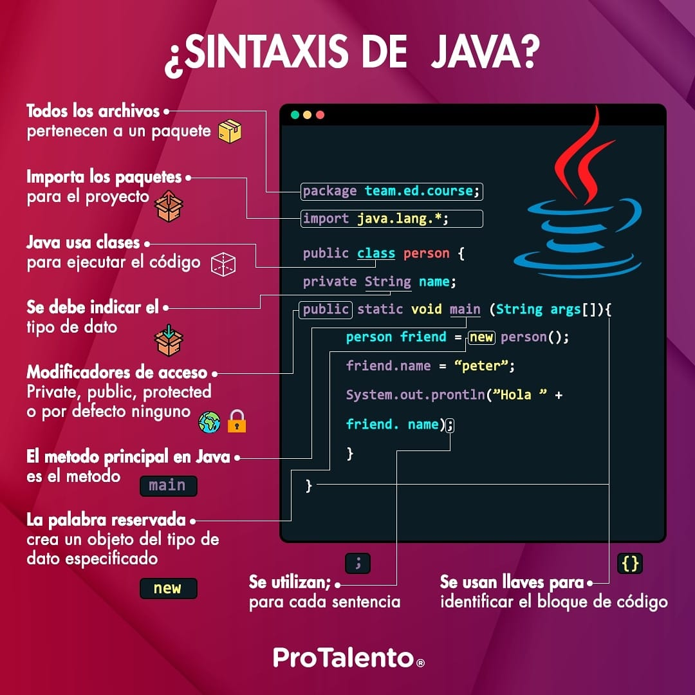
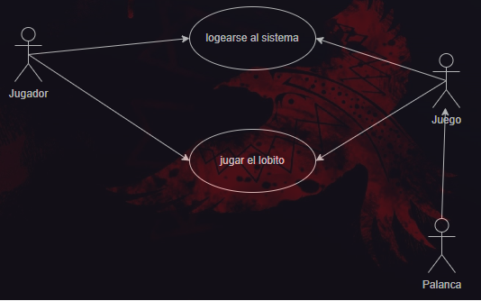
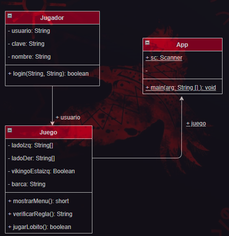

# <div align="center">**Escuela Politécnica Nacional**</div>
### <div align = "center">**Facultad de Ingeniería en Sistemas**</div>
### <div align = "center">**Ingeniería en Ciencias de la Computación**</div>
### <div align = "center">**Programación II**</div>
<br>
<br>
<p align = "center">
</p>
</br>
</br>

## **Semana 1**
### ***Clase 1: Martes, 30 de abril de 2024***
El primer encuentro entre estudiantes, presentación habitual y pautas de las clases mostradas a continuación:
##### *Datos generales*
- ***Dias de clase:*** Lunes/Martes/Miércoles
- ***Horario de clase:*** De 11h00 a 13h00
- <span style="background:#1FF000"> ***Puntualidad:*** Se permite llegar hasta 10 minutos tarde.</span>
- ***Profesor:*** Patricio Paccha (pat-mic)
##### *Indicaciones (Pruebas-Examenes-Proyecto)*
- Las pruebas durarán de 2 a 4 horas
- Los examenes durarán 8 horas
- El proyecto deberá tener una parte física, es decir, un aparato externo
- El proyecto deberá presentarse una parte al final del primer bimestre, y lo restante al final del semestre
- El markdown de cada estudiante deberá ser presentado al final de cada bimestre
##### *Recursos de trabajo grupal*
- Marcadores de pizarra
- Hojas de papel bond
- Pc's o celulares
- Pósits
- Taza de café (Opcional)
- Actidud: No trompud@, no brav@, no chuki
##### *Normativas*
- No llegar tarde a clases
- No hablar en el celular en clase, mantener en modo silencio
- Evitar comer alimentos en clase
- No distraerse en la computadora en actividades ajenas a la clase
- No entregar tareas, deberes, laboratorios, ni proyectos atrasados
- Subir las tareas a la plataforma virtual (o por correo)
- Pruebas teoricas en plataforma vitual (o escritas)
- Se tomará en cuenta la participación de eventos académicos que organice la Facultad de Sistemas
##### *Sistema de evaluaciones*
<center>

| Evaluación | Puntaje | Temporalidad |
|---|---|---|
| Prueba | 25% | Mensual |
|Examen|25%|Bimestral|
|Workshop|10%|Mensual|
|Homework|10%|Mensual|
|Proyecto|30%|Bimestral|

<br></br>
||||
|---|---|---|
|Actuacion|+0.1|Siempre|
|Retor|+1.0|Siempre|
</center>

##### *Taller MA01*
El taller consistió en realizar una torre de malvaviscos y fideos, los malvaviscos como uniones y los fideos como columnas/vigas, todo esto con la menor cantidad de recursos posibles e intentando obtener la mayor altura posible.

-----------
### ***Clase 2: Miércoles, 1 de mayo de 2024***
##### *Personalización Visual Studio Code*
- Se presentaron y añadieron extensiones útiles para el trabajo como markdownPDF, blackbox AI, gitLens y vscode-pdf.
- Se puede personalizar la terminal de PowerShell, git bash y la predeterminada de windows siguiendo el tutorial encontrado en la página OhMyPosh.
##### *Comandos Linux*
1. pwd : lugar actual

2. touch readme.md : crear archivos  

3. code readme.md : abrir archivos     

4. ls : listar archivos y carpetas 

5. cd : cambia directorio de trabajo 

6. mkdir : crea nuevo directorio
   
7. rm : elimina un archivo 

8. cp : copiar archivos-directorios (incluido contenido)

9. mv : mueve o renombra archivos-directorios

10. file : comprueba tipo archivo

11. ls-la : lista ocultar archivos y directorios

12. nano, vi y jed : edita un archivo con un editor de texto

13. cat : lista, combina y escribe contenido de un archivo 

14. sed : busca, sustituye o elimina patrones en un archivo 

15. sort : reordena el contenido de un archivo 

16. diff : compara el contenido de dos archivos 

17. locate : busca archivos en la base de datos de un sistema

18. find : muestra ubicacion de un archivo o carpeta 

19. useradd/userdel : crea y elimina cuenta de usuario

20. df : muestra uso general de espacio en disco 

21. du : comprueba consumo almacenamiento de archivo o directorio

22. scp : copia de forma segura archivos o directorios a otro sistema

23. man : muestra el manual de un comando 

24. echo : imprime un mensaje como salida estandar 


##### *Comandos VSCode* 

1. Ctrl + Shif + P : abre paleta de comandos 

2. Ctrl + P : apertura rapida

3. Ctrl + B : abrir y cerrar el menu

4. Ctrl + D : cursor seleccion multiple

5. Shif + Alt + ⭡ / Shif + Alt + ⭣: copiar linea 

6. Shif + Alt + A (comentario varia lineas) | Ctrl + K + C (comentario una sola linea) : 
Bloque de codigo de comentario 

1. Alt + ⭠/⭢ : retroceder/avanzar 

2. Ctrl + T : mostrar todos los simbolos 

3. Ctrl + space | Ctrl + Shif + Space : sugerencia de activacion-parametros de activacion

4.  Ctrl + Shif + N : abre ventana nueva 
  
5.  Ctrl + Shif + W : cierra una ventana 

6.  Ctrl + C : copia fragmento de codigo 

7.  Ctrl + X : corta fragmento de codigo

8.  Ctrl + V : pega formato codigo copiado/cortado

9.  Ctrl + +/- : aumentar tamaño de letra/disminuir

10. Ctrl + O : abre explorador de archivos 

11. Ctrl + N : Crea un nuevo archivo 

12. Ctrl + S : Guarda 

13. Ctrl + F | Ctrl + H  : abre buscador | sustituir texto 

14. Ctrl + G : Desplazarnos a la linea que nos interesa

#### *Uso de Markdown* 

* **Tipo de letra:**
   - **palabras en negrita** : Con ** palabra-frase **
   - *palabras en cursiva* :  Con * palabra-frase * 
   - ***palabras en negrita y cursiva***: Con *** palabra-frase ***
   - ==texto resaltado== : Con == palabra-frase ==
   - ~~texto tachado~~: Con ~~ palabra-frase ~~

* **Listas:** 
  ###### Lista no ordenada: Añadiendo - por cada item                  
  - Elemento 1
  - Elemento 2
  - Elemento 3 
  ###### Lista ordenada: Añadiendo 1.y 2. sucesivamente por cada item
   1. Primer elemento 
   2. Segundo elemento 
   3. Tercer elemento
  
* **Enlaces:** 

 - [buscador google](http://google.com): Usando [nombre cualquiera] (link), sin espacio

 - : Usando 
* **Etiqueta:** 
 
 <br> Con 

 ##### *Codigo Java*

 ```java
public class Hola {

  // Clase principal de la aplicacion 

  public static void main(String[] args) {
    System.out.println();
  }
}
```
Iniciando con ´´´NombreLenguajeDeProgramación y terminando con ´´´
##### *Tabla* 

|Columna 1|Columna 2|
|--------|--------|
|    A    |    B    |
|    C    |    D    |

Usando 
|Nombre de columna 1|Nombre de columna n|
/|---|---|   Sin /
|fila 1 columna 1| fila 1 columna n|
|fila n columna 1| fila n columna n| 
##### *Bloques de codigo:* 
  - comillas invertidas ---> ´codigo en linea´
  - citas ---> crear citas utilizando el signo ">"

* Lineas horizontales: 
---------
  - Guiones: ------
  - Asteriscos: *****
  - Guiones bajos: _____

##### Comandos de Git
###### Configurar identidad de Git/ Verificar
- git config --globarl user.name "nombre de usuario"
- git config --global user.email "correo electronico"
- git config user.name
- git config user.email
- touch NombreNuevoArchivo : Añade archivos al directorio actual
###### Control de versiones
- git init : Registra los archivos del directorio actual
- git status : Muestra los archivos sin guardar o no registrados por git
- git add . : Añade a lectura por git todos los archivos del directorio actual
- git commit -m "mensaje" : Guarda los cambios realizados con un comentario (mensaje)
- git push origin main: Envía a la nube (GitHub) los cambios realizados 
- git log : Muestra los commits guardados
###### Inicio del control de versiones -clonando
- git clone linkGitHub
- git clone linkGitHub Nombre
###### Actualizar repositorio
- git pull origin main
- git fetch origin NombreRama: Descarga pero no actualiza/une los nuevos cambios del repositorio
###### Quitar archivos del control
- echo "nombreArchivo.ext >> .gitignore
- echo ".txt" >> .gitignore
###### Ver archivos ignorados
- cat .gitignore
###### Forzar agregar archivo excluido
- git add -f NombreArchivo
###### Branches/Ramas
- git checkout -b NombreNuevaRama: Crea una nueva rama en el repositorio
- git checkout NombreRama: Moverse a otra rama
- git branch -d NombreRama: Elimina una rama
- git push origin NombreRama: Manda los cambios a la nube, especificamente a la rama seleccionada
- git checkout -M main: Cambia el nombre de la rama principal a "main"
###### Merge/Union de Ramas
- git merge NombreRama: Une los cambios de la rama seleccionada a la rama actual
- git diff Rama1 Rama2: Mirar los cambios entre la rama 1 y la rama 2
###### Eliminar archivos
- git rm NombreArchivo
- git rm -r
###### Tagging
- git tag NombreTag CodigoCommit: Etiqueta un commit en especifico(Para commits importantes)
- git log: Visualiza los ID's de los commits
##### Clave SSH
Utilizar primero:
```ssh-keygen -t ed25519 -C "corre_electronico" ```
Luego, presionar enter hasta visualizar la frase: ```The key's randomart image is:```
Usar despues, ```eval "$(ssh-agent -s)"``` para verificar que el agente ssh se este ejecutando.
Luego, agregamos la llave privada SSH al ssh agent ejecutando:
```ssh-add ~/.ssh/id_ed25519```
Para visualizar la clave SSH ejecutamos:
```cat id_ed25519.pub```
Finalmente copiamos esta clave y nos dirigimos a GitHub, en Configuraciones buscar SSH and GPG keys y agregarla.
Comprobar que la clave funciona ejecutando:
```ssh -T git@github.com```
Si observamos una advertencia como:

```
The authenticity of host "github.com(IP ADDRESS)" can't be stablished
ED25519 key fingerprint is SHA256: Clave.
Are you sure you want to continue connecting (yes/no)?
```
Escribir yes y observar que la clave funciona exitosamente.

### ***Clase 3: Lunes, 6 de mayo de 2024***

#### *Programación orientada a objetos*
El primer lenguaje de programación para orientación a objetos nació en 1960, se llamó *Simula*.
#### *Historia de Java*
Java nació en 1991, creado por *James Gosling* en *Sun Microsystems. 
En 1995, se lanzó la versión 1.0 de Java.
En 2009, *Oracle* adquirió *Sun Microsystems*.
#### *Características de Java*
- **Orientación a objetos**: Java es un lenguaje de programación orientado a
objetos, lo que significa que se basa en la creación de objetos que interactúan entre sí.
- **Independencia de plataforma**: Java es un lenguaje de programación que permite ejecutar el mismo código en diferentes plataformas (Windows, Linux, macOS, etc).
- **Robusto**: Java tiene un sistema de tipos estáticos y un recolector de basura automático, lo que lo hace más seguro y confiable.
- **Sencillo**: Java es un lenguaje de programación fácil de aprender y utilizar
- **Multihilo**: Java soporta la programación multihilo, lo que permite ejecutar varios procesos al mismo tiempo.

#### *Sintaxis de Java*
- ```package``` Son todos los achivos que petenecen a un paquete, se coloca al inicio del archivo, es opcional
- ```import``` Importa los paquetes para el proyecto, es opcional, va después del package
- ```public``` **```class```** ```Person```: Java usa clases para ejecutar el codigo
- ```public static void main (String args[]){Código}```: Es la función principal de Java.

Todo esto se ve reflejado en la siguiente imagen:
<p align = "center">

#### Programación estructurada Vs Programación orientada a objetos
- ***UML***: Lenguaje de modelado unificado, fue presentado para diseñar con graficos el sistema.

|P.E|P.O.O|
|--------|--------|
|Struct|Clase|
|Variable|Variables/Propiedades-Atributo<br>Las variables pertenecen a los metodos, si no son propiedades|

***Ejemplo de codigo en UML P.O.O.***
```
public class Animal{
  public int id;
  private string nombre;
  protected char algo;
  friendly boolean algo;

  public static void main(){
    Animal a = new Animal; ///Declara una variable perteneciente a la clase Animal
  }
}
```
- Una diferencia de P.O.O. con P.E. es que se añade el ambito, que va antes de declarar el tipo de dato, en este caso se tienen las mas comunes public, private, protected y friendly. Van debajo de la clase usualmente, pueden ir debajo también. Si no se coloca el ámbito, en el caso de Java los declara automáticamente como private.

***Ejemplo de codigo en UML P.E***
```
#include <iostream>
#include <string>
struct Animal{
  string/char/etc Algo;
} type of animal;

void main(){
  animal *A = new Animal; ///Declara que se apunta al struct
  A->Algo = "algo"; ///Indica que se usará la memoria del puntero, no su direccion
  ...
}
```
***Cuadro de UML general***
|Nombre de la Clase|Animal|
|--|--|
|Propiedades|+id: int<br>+nombre: string|
|Metodo||
|Eventos(Opcional)|+main(): void|

- El simbolo + se usa en lugar de colocar el ambito public.
- El simbolo - se usa en lugar de colocar el ambito private. 
- El simbolo # se usa en lugar de cologar el ambito protected.

###### POO: Metodo sin retorno
- Metodo que no devuelve ningun valor o cosa, es decir, un procedimiento.
###### POO: Metodo con retorno
- Metodo que retorna algun valor o cosa, es decir, es una funcion.

## **Semana 2**
### ***Clase 4: Lunes, 13 de mayo de 2024***
#### P.O.O. : Conceptos, resolución de problemas
Sobre los objetos se pueden hace dos cosas: Caracterizar (Propiedades) y Acciones (Métodos).

- **Propiedades:** Son los atributos que tiene un objeto, es decir, lo que describe a un objeto. También se puede ver como las características que tiene un objeto, se puede ver facimente estas graficando el objeto y describiéndolo.
###### Ejemplo:
El objeto es una mujer, las propiedades caracteristicas pueden ser:
```
Género: 10, tipo de cabello: "Lacio", tipo de ojos: "verdes-alargados", estatura: 1,80, numero de brazos: 2, edad: 10, etc.
```
- **Métodos:** Son las acciones (Verbos en infinitivo) que puede realizar un objeto, es decir, lo que hace un objeto. Se realizan estos en base a las propiedades, es decir están directamente relacionadas a las ***propiedades***. Estas acciones pueden o no tener ***parámetros***. 
Los parámetros son similares a las propiedades, con la diferencia que los parámetros.
Los métodos son similares a las funciones con la diferencia que estos tienen un ámbito (public: +, private: -, protected: ~, friendly: #, etc).
Los métodos pueden retornar un valor o no, 
###### Ejemplo:
```
Caminar(), Caminar(tiempo,lugar) 
Dormir(tiempo, posición, lugar), respirar(), comer(tiempo, lugar, tipo) 
Hablar( ), saltar(lugar, cantidad ), tocar(tiempo,lugar) 
Bailar(canción, tipo, ritmo). 
```
<br></br>
Ya definidas las propiedades y los métodos se puede definir el ámbito del objeto.
Para el mismo objeto mujer.
###### Ejemplo:
```java
-Edad: 14
+Genero: "mujer"
+Ojos: "verdes-alargados"
+NumeroDeBrazos: 3
public caminar(tiempo, lugar)
protected dormir(tiempo, posición, lugar)
private comer(tiempo, lugar, tipo)
public saltar(lugar, cantidad)
public tocar(tiempo, lugar)
friendly bailar(cancion, tipo, ritmo)
```

#### UML: Unified Modeling Language (Lenguaje de modelado unificado)

Dependiendo del objeto que estemos diseñando o modelando, se pueden utilizar solo propiedades, o solo acciones, o las dos.
Modelando el objeto anteriormente visto, mujer, resulta:
Para este caso, creamos una clase llamada ```Hombre``` que tenga un método ```sentir(Mujer)``` con un parámetro de objeto, para añadir algo al cuadro ***Evento*** del cuadro UML **MUJER**.
|MUJER|
|--|
|- Edad: float <br>+ TipoDeCabello: String <br>+ TieneOjos: boolean <br> **...**|
|~ Bailar (cancion: String, tiempo: int, ritmo: String): **String/void/boolean/...** (Retorno)<br> ~ Tocar (tiempo: int, lugar: String): boolean <br> + Saltar (lugar: String, cantidad: Int): void <br> **...**|
|~ Sentir (hombre: Hombre) : Puede tener o no retorno|

<br></br>
Después de realizar el cuadro UML, se puede realizar el código en cualquier lenguaje P.O.O.
Para esto, utilizaremos el cuadro de UML **MUJER**.
###### Ejemplo:
```java
public class Mujer(){
  private float Edad;
  public boolean TieneOjos; 
  public String TipoDeCabello;
  ...
  protected String Bailar (String cancion, int tiempoMin){
    ...
    return "Bla bla bla";
  }
  ...
}
```
<span style="color: white ; background:#370c14">*Nota: Para la documentación de un código es necesario agregar un README* </span>
#### Bucles
Un bucle es una estructura de control que permite repetir una serie de instrucciones mientras se cumpla una condición determinada. Teniendo en cuenta esto, se creó un Java Project donde:
- Se crea una carpeta donde se almacenaran los archivos del proyecto.
- El proyecto contiene tres carpetas principales: source/src, bin y lib. También se encuentra usualmente dentro de esta una carpeta adicional relacionada al IDE que se use, en nuestro caso, para Visual Studio Code se añadió la carpeta .vscode.
- Dentro de la carpeta source/src se encuentra el archivo App.java que es el archivo principal, se pueden crear otros archivos .java como clases.
- Las clases que se pueden crear pueden ser de varios tipos: class, Interface, Enum, Recor, Annotation, Abstract Class, Package y File.

###### *Trabajo en Clase: Crear un bucle cuyo output sea: +-+-+-+- ...* 

```java
public class BucleFor {
    public void SignoAlterno(){
        for(int i=1;i<=15;i++){
            if (i%2==0) {
                System.out.println("-");
            }else{
                System.out.println("+");
                
            }
        }
    }
}
```
El llamar a un bucle desde la App se llama instanciación, se crea la variable y se instancia con la palabra reservada ***new***, esto lo que hace es pedir un nuevo espacio de memoria conforme se requiera, lo que consecuentemente reduce el consumo de memoria de nuestro dispositivo.
Ejemplo:
```java
BucleFor bf = new BucleFor();
```
<span style="color: white ; background:#370c14">*Nota: En el caso de compilar el programa sin el uso de la tecla F5, se puede escribir en la terminal javac App.java -d 'Directorio' para enviar el archivo .class de nuestro .java hacia la carpeta bin, esto para una mejor visualización de los archivos en src* </span>

##### <span style="color: white ; background:#0c1424">*Deber: Conceptualizar un animal salvaje: 3 Propiedades/ 3 Métodos, Cuadro UML, Código. En cuaderno/hoja.*</span>

### ***Clase 5: Martes, 14 de mayo de 2024***
#### Bucles (Parte 2)
Siguiendo el proceso de la anterior parte de Bucles, el código que se debería ver en la clase main, dentro de la App, debería visualizarse de la siguiente manera:

```java
public class App {
    public static void main(String[] args) throws Exception {
        BucleFor bf; //Declaración de la variable dentro de la clase BucleFor
        bf = new BucleFor(); //Instanciación de la variable a través de new
        bf.signoAlterno(); //Invocación del método signoAlterno
    }
}
```
###### *Trabajo en Clase 1: Compactar el código antes creado* 

Para ello, antes de compactar el código se mostrará una forma distinta de imprimir la secuencia + - + - + - ... Esto mediante el uso de tres bucles for y un condicional if-else anidado. Esto de la siguiente forma:
```java
public void signoAlternoGenerativo(){
        System.out.println("FOR: ");
        for(int i=1;i<10;i++){
            if(i%2==0){
                for(int sn=1;sn<i;sn++)
                    System.out.print("- ");
            }else{
                for(int sp=1;sp<i;sp++)
                    System.out.print(" + ");
                    System.out.print("  ");
            }
        }
        System.out.println("");
    }
```
Ahora, para compactar el código podemos hacer uso del operador ternario de la siguiente forma:
```java
    public void signoAlternoCompactado(){
        System.out.println("FOR: ");
        for(int i=1;i<10;i++){
            for(int s= 1 ; s < i ; s++)
                System.out.print((i%2==0)?"-":"+");
            System.out.print("  ");
        }
        System.out.println("");
    }
```
Es necesario recalcar que estos métodos void se encuentran dentro de la clase pública *BucleFor*.

###### *Trabajo en Clase 2: Crear un patron de escalera con |_* 

Se desarrolló este patron mediante el uso de dos bucles for, uno de estos anidado, y definiendo el *String "|_"*, de igual forma este método se encuentra dentro de la clase pública *BucleFor*, a continuación el código:
```java
  public void metodoEscalera(){
        System.out.println("Escalera: ");
        int altura = 10;
        String escalera= "|_";
        for(int i=1;i<altura;i++){
            for(int s=1;s<i;s++)
                System.out.print("  ");
            System.out.println(escalera);         
        }
    }
```
###### *Trabajo en Clase 3: Crear una nueva clase donde se tenga un método que imprima el mismo patrón utilizando while en lugar de for* 

Primero, se creó una nueva clase llamada *BucleWhile* y dentro de ella se definió el método *signoAlterno*. A continuación se muestra el proceso para cambiar el algoritmo hecho con un bucle for, a un bucle while:

***1. Reconocemos la estructura del bucle while: ```while(condicion de finalizacion){code}``` y el bucle for: ```for(iterador ; condicion de finalizacion; intervalo de cambio(incremento/decremento)){code}```***

***2. Inicializamos el iterador del bucle for fuera del bucle while, con el mismo valor del bucle for.***

***3. Establecemos la condicion de finalizacion del bucle for, en la condicion de finalizacion del bucle while.***

***4. Establecemos el intervalo de cambio(incremento/decremento) dentro del bucle while, es decir en ```{code}```.***

Ya explicado el proceso de cambio de bucle for hacia bucle while, creamos el método que se visualizará de la siguiente forma:
* *Primer Método*
```java
public void signoAlterno(){
        System.out.println("WHILE: ");
        int i=1;
        while (i<10) {
            if(i%2==0)
                System.out.print("- ");
            else
                System.out.print("+ ");
            i++;
        }
        System.out.println();
    }
```
* *Segundo Método (Generativo)*
```java
public void signoAlternoGenerativo(){
        System.out.println("WHILE");
        int i=1;
        while(i<10){
            int s= 1;
            while(s < i){
                System.out.print((i%2==0)?"-":"+");
                s++;
            }
            System.out.print("  ");
            i++;
        }
        System.out.println("");
    }
```
* *Tercer Método (Compactado usando operador ternario)*
```java
    public void signoAlternoCompactado(){
        System.out.println("WHILE: ");
        int i = 1;
        while (i < 10){
          int s =1;
          while(s < i){
            System.out.print((i%2==0)?"-":"+");
            s++;
          }
          System.out.print("  ")
          i++;
        }
    }
```

##### <span style="color: white ; background:#0c1424">*Deber Grupal: Crear un proyecto por grupo donde cada integrante crea su propio archivo, cada integrante debe realizar metodos que impriman la inicial de su nombre, apellido y las dos iniciales juntas. Estos métodos deben ser realizados utilizando tres bucles: for, while y do-while cada inicial.*</span>

### ***Clase 6: Miércoles, 15 de mayo de 2024***
#### POO: Programación Orientada a Objetos

##### 1. Conceptualización

Solventar problemas mediante el prototipado y el flujo de acciones del trabajo que se realiza. En esta etapa, se deben definir claramente las propiedades (datos) y los métodos (acciones) de los objetos.

- **Propiedades:** Datos o características que se pueden almacenar. Por ejemplo:
  - Persona: 
    - `+nombre: String`
    - `+edad: int`
    - `~altura: float`
    - `-peso: float`
    - `#colorOjos: String`

- **Métodos:** Verbos, funciones o procedimientos que pueden ser públicos, privados, protegidos o amigables. Por ejemplo:
  - `+caminar(distancia: float, velocidad: float): void`
  - `~dormir(horas: int, posicion: String): void`
  - `-comer(alimento: String, cantidad: float): void`
  - `#bailar(estilo: String, duracion: int): String`

Es importante que ambos (propiedades y métodos) tengan un ámbito definido: público (+), privado (-), protegido (~), amigable (#).

##### 2. UML: Lenguaje Unificado de Modelado

Una clase es un tipo de objeto, una plantilla o un prototipo. 

- **Clase:** Representa un concepto o entidad.
  - **Atributos:** Características del objeto.
  - **Métodos:** Acciones que el objeto puede realizar.

Por ejemplo:

| Clase          | Descripción                                          |
|----------------|------------------------------------------------------|
| **Propiedades**|                                                      |
| +nombre: String | Nombre de la persona                                 |
| -edad: int     | Edad de la persona (atributo privado)                |
| ~altura: float | Altura de la persona                                  |
| #colorOjos: String | Color de ojos de la persona (atributo amigable)  |
| **Métodos**    |                                                      |
| +caminar(distancia: float, velocidad: float): void | Realiza una caminata a una distancia y velocidad específicas |
| ~dormir(horas: int, posicion: String): void | Duerme durante un número de horas en una posición específica |
| -comer(alimento: String, cantidad: float): void | Come una cantidad específica de un alimento |
| #bailar(estilo: String, duracion: int): String | Baila un estilo específico durante una duración determinada |

##### 3. Código (Java)

Todo se traduce del diagrama al código. Por ejemplo, una clase `Persona` en Java:

```java
public class Persona {
    private int edad;
    public String nombre;
    protected float altura;
    String colorOjos;

    // Constructor
    public Persona(String nombre, int edad, float altura, String colorOjos) {
        this.nombre = nombre;
        this.edad = edad;
        this.altura = altura;
        this.colorOjos = colorOjos;
    }

    // Método público
    public void caminar(float distancia, float velocidad) {
        System.out.println(nombre + " está caminando " + distancia + " metros a una velocidad de " + velocidad + " m/s.");
    }

    // Método protegido
    protected void dormir(int horas, String posicion) {
        System.out.println(nombre + " está durmiendo durante " + horas + " horas en la posición " + posicion + ".");
    }

    // Método privado
    private void comer(String alimento, float cantidad) {
        System.out.println(nombre + " está comiendo " + cantidad + " gramos de " + alimento + ".");
    }

    // Método amigable
    String bailar(String estilo, int duracion) {
        return nombre + " está bailando " + estilo + " durante " + duracion + " minutos.";
    }
}
```

##### <span style="color: white ; background:#0c1424">*Deber: En una hoja, conceptualizar un animal salvaje. Debe tener como mínimo 3 propiedades y 3 métodos de cualquier tipo*</span>

### ***Clase 7: Lunes, 20 de mayo de 2024***
#### Getter y Setter
Los getters y setters son métodos utilizados en la programación orientada a objetos para acceder y modificar los atributos de una clase de manera controlada. Aquí tienes información más detallada sobre cada uno:
##### Getter (Método de Acceso)
Un getter es un método que permite acceder a un atributo privado de una clase desde fuera de la misma. Se utiliza para obtener el valor de un atributo encapsulado, proporcionando así una forma controlada de acceder a la información. Por lo general, un getter tiene la estructura getNombreAtributo() donde NombreAtributo es el nombre del atributo al que se quiere acceder.
Ejemplo:
```java
public class Persona {
    private String nombre;
    public String getNombre() {
        return nombre;
    }
}
```
##### Setter (Método de Modificación)
Un setter es un método que permite modificar el valor de un atributo privado de una clase desde fuera de la misma. Se utiliza para establecer un nuevo valor a un atributo encapsulado, asegurando así que la modificación se realice de manera controlada según las reglas de la clase. Por lo general, un setter tiene la estructura setNombreAtributo(NuevoValor) donde NombreAtributo es el nombre del atributo que se quiere modificar y NuevoValor es el valor que se desea establecer.
Ejemplo:
```java
public class Persona {
    private String nombre;
    public void setNombre(String nuevoNombre) {
        this.nombre = nuevoNombre;
    }
}
```
##### Beneficios
* Los getters y setters son fundamentales para la encapsulación en programación orientada a objetos, ya que permiten controlar el acceso a los atributos de una clase.
* Permiten establecer reglas y validaciones al momento de acceder o modificar los valores de los atributos.
* Facilitan la modularidad y el mantenimiento del código, ya que los cambios en la implementación interna de una clase no afectan a los usuarios externos que utilizan los getters y setters para interactuar con la clase.
##### Consideraciones - Usos
* ***Encapsulación:*** Los getters y setters son parte fundamental del concepto de encapsulación en la programación orientada a objetos. La encapsulación se refiere a ocultar los detalles internos de una clase y exponer solo una interfaz controlada para interactuar con ella. Los getters y setters proporcionan esta interfaz controlada para acceder y modificar los atributos de la clase.

* ***Acceso Controlado:*** Los getters y setters permiten controlar cómo se accede y se modifica la información en una clase. Por ejemplo, puedes establecer reglas de validación en un setter para asegurarte de que los nuevos valores asignados a un atributo cumplen ciertas condiciones.

* ***Visibilidad de Atributos:*** Es común que los atributos de una clase se declaren como privados (```private``` en Java, por ejemplo) para restringir el acceso directo desde fuera de la clase. Los getters y setters proporcionan una forma segura de acceder a estos atributos privados sin exponerlos directamente.

* ***Flexibilidad y Mantenimiento:*** Al utilizar getters y setters, puedes modificar la implementación interna de una clase (como cambiar la representación de un atributo o agregar validaciones) sin afectar el código externo que utiliza esos métodos. Esto proporciona flexibilidad y facilita el mantenimiento del código a largo plazo.

* ***Convenciones de Nomenclatura:*** Existen convenciones de nomenclatura comunes para los getters y setters. Por ejemplo, el nombre de un getter generalmente comienza con *get* seguido del nombre del atributo (por ejemplo, ```getNombre()```), y el nombre de un setter generalmente comienza con *set* seguido del nombre del atributo y un parámetro que representa el nuevo valor (por ejemplo, ```setNombre(String nuevoNombre)```).

* ***Evitar Acciones Complexas:*** Es importante recordar que los getters y setters deben mantenerse simples y no realizar acciones complejas o costosas. Su función principal es acceder y modificar atributos, no realizar cálculos intensivos o interacciones complejas con otras clases.

* ***Usar con Moderación:*** Si bien los getters y setters son útiles, es importante no abusar de ellos. No todos los atributos de una clase necesitan getters y setters; solo aquellos que deben ser accesibles desde fuera de la clase de manera controlada deben tener métodos asociados.

### ***Clase 8: Martes, 21 de mayo de 2024***
#### Diagrama de Caso de Uso
Los diagramas de caso de uso constan de varios elementos esenciales que ayudan a visualizar y comprender el sistema en cuestión. Estos elementos incluyen:

- ***Actor:*** Representa a cualquier entidad externa que interactúa con el sistema y desempeña un papel específico en el contexto del sistema.

- ***Caso de uso:*** Describe una función o una acción específica que el sistema realiza en respuesta a una solicitud del actor. Ejemplifica una interacción entre el sistema y sus actores.

- ***Flujo de control:*** Define la secuencia de eventos que ocurren cuando se ejecuta un caso de uso, desde el inicio hasta el resultado final. Especifica cómo se lleva a cabo la interacción entre el actor y el sistema.

- ***Flujo de datos:*** Muestra cómo se transmiten los datos entre los diferentes elementos del sistema durante la ejecución de un caso de uso. Ilustra la transferencia de información y los procesos involucrados.

- ***Relación entre casos de uso:*** Establece conexiones y dependencias entre diferentes casos de uso. Puede indicar la inclusión de un caso de uso dentro de otro, la extensión de un caso de uso existente, entre otros tipos de relaciones.
  - **<< include >>:** Indica que un caso de uso incluye otro caso de uso.
  - **<< extend >>:** Indica que un caso de uso puede extenderse bajo ciertas condiciones a otro caso de uso.
- ***Relación entre actor y caso de uso:*** Define cómo un actor específico está asociado con un caso de uso en particular, mostrando qué funciones puede realizar ese actor dentro del sistema.

- ***Relación entre actor y actor:*** Representa las interacciones o dependencias entre diferentes actores dentro del sistema. Puede mostrar roles complementarios, colaboraciones o jerarquías entre actores.

- ***Relación entre actor y flujo de datos / control:*** Describe cómo un actor está involucrado en la transferencia de datos o en el control de los eventos dentro del sistema. Estas relaciones detallan la participación activa del actor en las operaciones del sistema.


##### Ejemplo de Diagrama de Caso de Uso
<p align = "center">
</p>

#### Diagramas de Clase

Un diagrama de clase es una representación visual de la estructura y las relaciones entre las clases en un sistema de programación orientada a objetos. Los diagramas de clase se utilizan para modelar la estructura de una aplicación y mostrar cómo se relacionan las clases entre sí. Los elementos clave de un diagrama de clase son:
- ***Clase:*** Representa una entidad abstracta que define un conjunto de objetos con características comunes.
- ***Atributo:*** Representa una característica o propiedad de una clase.
- ***Método:*** Representa una acción o función que puede realizar una clase.
- ***Relación:*** Representa la conexión entre dos o más clases.
- ***Herencia:*** Representa la relación entre una clase padre y una clase hija, donde la clase hija hereda los atributos y métodos de la clase padre.
- ***Composición:*** Representa la relación entre una clase contenedora y una clase contenida, donde la clase contenedora tiene una o varias instancias de la clase contenida.
- ***Asociación:*** Representa la relación entre dos o más clases que se refieren entre sí.
- ***Dependencia:*** Representa la relación entre dos clases donde una clase depende de la otra para funcionar  correctamente.
##### Pasos para crear un Diagrama de Clase

**1. Identificar las clases:** Encuentra los objetos principales: El punto de partida son los objetos principales del sistema, que suelen ser sustantivos dentro del dominio del problema que se está modelando.
  - ***Ejemplos:*** En una tienda online, las clases podrían ser  "Producto", "Cliente", "Pedido", etc.

**2. Distinguir las relaciones:** Analizar las relaciones: Determina cómo interactúan las clases entre sí. Busca puntos en común y abstracciones que puedan ayudar a agruparlas.
  - ***Tipos de relaciones:*** Las relaciones comunes incluyen asociación, agregación, composición e herencia.
  - ***Ejemplos:*** Un "Pedido" se asocia con un "Cliente" y tiene varios "Productos". Un "Producto" puede pertenecer a una categoría específica (herencia).

**3. Crear la estructura del diagrama:** Agregar las clases: Representa cada clase con un rectángulo que contenga su nombre.
  - ***Conectar las clases:*** Usa flechas con los símbolos adecuados para indicar las relaciones entre las clases.
  - ***Cardinalidad:*** Especifica la cantidad de objetos de una clase que pueden relacionarse con otra (por ejemplo, uno a varios, uno a uno).
  - ***Herencia:*** Indica las relaciones de herencia entre clases con una flecha triangular que apunta a la clase superior.
  - ***Atributos y funciones:*** Una vez que la estructura básica esté definida, agrega los atributos (características) y las funciones (métodos) de cada clase dentro de sus rectángulos.

##### Buenas prácticas para diagramas de clases efectivos:

***1. Evitar diagramas grandes:*** Dividir y conquistar: Si el sistema es complejo, crea varios diagramas más pequeños y vincúlalos entre sí para una mejor comprensión.
***2. Usar notación simple:*** Emplea una notación simple y clara para crear una visión general de alto nivel. Los detalles adicionales se pueden agregar en diagramas separados si es necesario.
***3. Minimizar las líneas cruzadas:*** Dispón las relaciones entre clases de manera que se minimicen las líneas cruzadas, mejorando la legibilidad del diagrama.
***4. Usar colores para agrupar:*** Asigna colores a las clases que pertenecen a un mismo módulo o subsistema para facilitar su identificación.
##### Ejemplo de Diagrama de Clase

<p align = "center">
</p>

<span style="color: white ; background:#370c14">*Nota: Usualmente para cada proyecto de java se creará una carpeta nombrada *design*, dentro de esta se creará un archivo .dio para realizar los diagramas de caso de uso y los diagramas de clase  </span>

#### Implementación de los diagramas en JAVA

Se tomó como ejemplo una clase Usuario cuyas propiedades son *nombre* y *edad* con los métodos: *ingresar* y *crearDino*. 

* ***Implementación clase Usuario***
```java
public class Usuario {
    private String nombre; 
    private Integer edad;

    public Integer getEdad() {
        return edad;
    }

    public void setEdad(Integer edad) {
        if(edad>0){
            this.edad = edad;
        }else{
            this.edad = 0;
        }
    }

    public String getNombre() {
        return nombre;
    }

    public void setNombre(String nombre) {
        this.nombre = nombre.toUpperCase();
    }

    public Boolean ingresar(){
        String nombreString;
        System.out.print("Dime tu nombre: ");
        nombreString = App.sc.nextLine();
        setNombre(nombreString);
        return true;
    }

    public void crearDino(){
        if(ingresar())
            System.out.println("Voy a crear un dino");
        else   
            System.out.println("Pirmero debes logearte al sistema");
    }

}
```
* ***Implementación en la App***
```java
import java.util.Scanner;

public class App {
    public static Scanner sc = new Scanner(System.in);
    public static void main(String[] args) throws Exception {
        Usuario oUsuario = new Usuario();
        oUsuario.crearDino();
               
    }
}
```
<span style="color: white ; background:#370c14">*Nota: Se añade una *o* antes de cada variable para denotarla como un objeto* </span>

### ***Clase 9: Miércoles, 22 de mayo de 2024***
Para esta clase, se tomó como referencia un supermercado (Tuti) para diagramar e implementar en código su funcionamiento a grandes rasgos.

#### Actores:

##### 0. Persona
**Propiedades:**
- -cedula: String
- -nombre: String
**Métodos:**
- +setCedula(cedula: String):void
- +getCedula(): String
- +setNombre(nombre: String):void
- +getNombre(): String
##### 1. Cliente:
**Propiedades (hereda de Persona):**
- -cedula: String
- -nombre: String

**Propiedades adicionales:**
- -dinero: float

**Métodos (hereda de Persona):**
- setCedula(cedula: String): void
- setNombre(nombre: String): void
- getCedula(): String
- getNombre(): String

**Métodos adicionales:**
- consultarSaldo(): float

##### 2. Cajero:
**Propiedades (hereda de Persona):**
- -cedula: String
- -nombre: String
**Propiedades adicionales:** 
- -usuario: String
- -clave: String

**Métodos (hereda de Persona):**
- +setCedula(cedula: String): void
- +setNombre(nombre: String): void
- +setUsuario(usuario: String): void
- +getCedula(): String
- +getNombre(): String
- +getUsuario(): String

**Métodos adicionales:**
- -iniciarSesion(usuario: String, clave: String): boolean
- ~registrarVenta(cliente: Cliente): void

##### 3. Supervisor:

**Propiedades (hereda de Persona):**
- -cedula: String
- -nombre: String

**Propiedades (hereda de Cajero):**
- -usuario: String
- -clave: String

**Propiedades adicionales:**
- -llaveAutenticacion: String

**Métodos (hereda de Persona):**
- +setCedula(cedula: String): void
- +setNombre(nombre: String): void
- +getCedula(): String
- +getNombre(): String

**Métodos (hereda de Cajero):**
- +iniciarSesion(usuario: String, clave: String): boolean
- +registrarVenta(cliente: Cliente): void
- +setUsuario(usuario: String): void
- +setClave(clave: String): void
- +getUsuario(): String
- +getClave(): String

**Métodos adicionales:**
- -iniciarSesion(usuario: String, clave: String): boolean
- -gestionarUsuarios(): void
- -consultarVentasTotales(): float
- +setLlaveAutenticacion(llaveAutenticacion: String): void
- +getLlaveAutenticacion(): String

#### Herencia:

- Persona es la clase padre de las clases Cliente, Cajero y Supervisor.
- Las clases hijas heredan las propiedades y métodos de la clase padre.
- Las clases hijas pueden tener propiedades y métodos adicionales propios.

**Ejemplo de relaciones:**

***1.*** *Un cliente puede realizar una compra a un cajero.*
***2.*** *Un cajero puede registrar una venta de un cliente.*
***3.*** *Un supervisor puede gestionar las cuentas de los usuarios (incluidos clientes y cajeros).*

### ***Clase 10: Lunes, 27 de mayo de 2024***
#### Constructores en JAVA
Un constructor es un método especial que se utiliza para inicializar objetos cuando se crean. Los constructores tienen el mismo nombre que la clase y no tienen tipo de retorno, ni siquiera void. Estan relacionados con el uso de `new` y los paréntesis `()`.
##### Características de los constructores
- Tienen el mismo nombre que la clase.
- Tienen el ámbito público o protegido, esto ya que si es privado no se podrá invocar fuera de la clase.
- No tienen tipo de retorno, ni siquiera void.
- Se utilizan para inicializar objetos.
- Se llaman automáticamente cuando se crea un objeto con `new`.
- Pueden tener parámetros.
- Pueden ser sobrecargados (overload).
##### Ejemplo de constructor
```java

public class Oso {

    // Atributos
    private String nombre;
    private String especie;
    private double peso;
    private boolean hiberna;

    // Constructor sin parámetros
    public Oso() {
        nombre = "";
        especie = "polar";
        peso = 500.0;
        hiberna = true;
    }

    // Constructor con un parámetro (nombre)
    public Oso(String nombre) {
        this.nombre = nombre;
        this.especie = "polar";
        this.peso = 500.0;
        this.hiberna = true;
    }

    // Constructor con dos parámetros (nombre y especie)
    public Oso(String nombre, String especie) {
        this.nombre = nombre;
        this.especie = especie;
        this.peso = 500.0;
        this.hiberna = true;
    }

    // Constructor con cuatro parámetros (nombre, especie, peso y hiberna)
    public Oso(String nombre, String especie, double peso, boolean hiberna) {
        this.nombre = nombre;
        this.especie = especie;
        this.peso = peso;
        this.hiberna = hiberna;
    }

    // Getters y Setters
    public String getNombre() {
        return nombre;
    }

    public void setNombre(String nombre) {
        this.nombre = nombre;
    }

    public String getEspecie() {
        return especie;
    }

    public void setEspecie(String especie) {
        this.especie = especie;
    }

    public double getPeso() {
        return peso;
    }

    public void setPeso(double peso) {
        this.peso = peso;
    }

    public boolean isHiberna() {
        return hiberna;
    }

    public void setHiberna(boolean hiberna) {
        this.hiberna = hiberna;
    }
}

```
En el ejemplo de la clase Oso, se observan cuatro constructores diferentes que facilitan la creación de objetos con distintas configuraciones iniciales. La sobrecarga de constructores permite definir múltiples constructores con conjuntos de parámetros variados, lo que brinda flexibilidad al crear instancias de la clase en diferentes estados.

##### Ejemplo de Sobrecarga

Se mostrará nuevamente, en específico, la sobrecarga del ejemplo anterior:
```java
public class Oso {
    // Atributos
    private String nombre;
    private String especie;
    private double peso;
    private boolean hiberna;

    // Constructor sin parámetros
    public Oso() {
        nombre = "";
        especie = "polar";
        peso = 500.0;
        hiberna = true;
    }

    // Constructor con un parámetro (nombre)
    public Oso(String nombre) {
        this.nombre = nombre;
        especie = "polar";
        peso = 500.0;
        hiberna = true;
    }

    // Constructor con dos parámetros (nombre y especie)
    public Oso(String nombre, String especie) {
        this.nombre = nombre;
        this.especie = especie;
        peso = 500.0;
        hiberna = true;
    }

    // Constructor con cuatro parámetros (nombre, especie, peso y hiberna)
    // Sobrecarga
    public Oso(String nombre, String especie, double peso, boolean hiberna) {
        this.nombre = nombre;
        this.especie = especie;
        this.peso = peso;
        this.hiberna = hiberna;
    }
}
```

###### *Trabajo en Clase: Realizar las clases Supervisor y Cajero*

* ***Clase Persona***
```java
public class Persona {
    private String cedula;
    private String nombre;
    private String apellido;

    // Constructor sin parámetros
    public Persona() {
        this.cedula = "";
        this.nombre = "";
        this.apellido = "";
    }

    // Constructor con parámetros
    public Persona(String cedula, String nombre, String apellido) {
        setCedula(cedula);
        setNombre(nombre);
        setApellido(apellido);
    }

    // Getters y Setters
    public String getCedula() {
        return cedula;
    }

    public void setCedula(String cedula) {
        if (cedula == null || cedula.length() != 10) {
            this.cedula = "No valida";
        } else {
            this.cedula = cedula;
        }
    }

    public String getNombre() {
        return nombre;
    }

    public void setNombre(String nombre) {
        if (nombre != null) {
            this.nombre = nombre.toUpperCase();
        } else {
            this.nombre = "";
        }
    }

    public String getApellido() {
        return apellido;
    }

    public void setApellido(String apellido) {
        if (apellido != null) {
            this.apellido = apellido.toUpperCase();
        } else {
            this.apellido = "";
        }
    }
}
```
* ***Clase Cajero***
```java

public class Cajero extends Persona {
    private String clave;
    private String usuario;

    // Getters y Setters
    public String getClave() {
        return clave;
    }

    public void setClave(String clave) {
        this.clave = clave;
    }

    public String getUsuario() {
        return usuario;
    }

    public void setUsuario(String usuario) {
        this.usuario = usuario;
    }
}

```
* ***Clase Supervisor***
```java

public class Supervisor extends Cajero {
    private String codigoAutorizacion;

    // Getters y Setters
    public String getCodigoAutorizacion() {
        return codigoAutorizacion;
    }

    public void setCodigoAutorizacion(String codigoAutorizacion) {
        this.codigoAutorizacion = codigoAutorizacion;
    }
}

```
* ***App/Main***
```java

public class App {
    public static void main(String[] args) {
        Persona oP = new Persona();
        Persona oP2 = new Persona(null, null, null);
        Supervisor oS = new Supervisor();

        oP.setCedula("1751381474");
        oP.setNombre("Pepe");
        oP.setApellido(null);

        System.out.println(oP.getCedula());
        System.out.println(oP.getApellido());
        System.out.println(oP.getNombre());

        System.out.println(oP2.getCedula());
        System.out.println(oP2.getApellido());
        System.out.println(oP2.getNombre());
    }
}

```

<span style="color: white ; background:#370c14">*Nota 1: Se pueden verificar errores en el codigo con Shift + Ctrl + B* </span>

<span style="color: white ; background:#370c14">*Nota 2: Para acceder al flujo de datos de manera más eficiente, se usa la clase Scanner* </span>

### ***Clase 11: Martes, 28 de mayo de 2024***
#### Diagramas de Flujo
##### Estructuras de Control
Las estructuras de control son los cimientos de cualquier programa, ya que permiten dirigir el flujo de ejecución en función de condiciones y decisiones. En Java, encontramos tres tipos principales:

* **1.1 Estructuras Secuenciales:**
Las estructuras secuenciales representan la ejecución ordenada de instrucciones una tras otra. Son como los pasos de una receta, donde cada línea de código se ejecuta en la secuencia en que aparece.
  - ***Ejemplo:***

```java
public class Secuencia {

    public static void main(String[] args) {
        System.out.println("1. Inicializar variables");
        System.out.println("2. Realizar cálculos");
        System.out.println("3. Mostrar resultados");
    }
}
```

* **1.2 Estructuras Condicionales:**
Las estructuras condicionales introducen la toma de decisiones en el programa. Permiten evaluar una condición y ejecutar un bloque de código en función del resultado (verdadero o falso). La más común es la instrucción if-else:
  - ***Ejemplo:***

```java
public class Condicional {

    public static void main(String[] args) {
        int edad = 18;
        if (edad >= 18) {
            System.out.println("Eres mayor de edad");
        } else {
            System.out.println("Eres menor de edad");
        }
    }
}
```

* **1.3 Estructuras de Repetición:**
Las estructuras de repetición permiten ejecutar un bloque de código de manera repetitiva hasta que se cumpla una condición específica. Las más utilizadas son los bucles for y while:
  - ***Ejemplo:***
```java
public class Repeticion {

    public static void main(String[] args) {
        for (int i = 1; i <= 10; i++) {
            System.out.println("Número: " + i);
        }

        int contador = 0;
        while (contador < 5) {
            System.out.println("Contador: " + contador);
            contador++;
        }
    }
}
```
#### Tipos de Datos:
Los tipos de datos definen la naturaleza de la información que se procesa en un programa. Java ofrece una variedad de tipos de datos primitivos y no primitivos para almacenar diferentes tipos de valores:

##### Tipos de Datos Primitivos:
- int: Números enteros (por ejemplo, 10, -200).
- long: Números enteros grandes (por ejemplo: 9223372036854775807).
- float: Números decimales con precisión simple (por ejemplo, 3.14, 5.2).
- double: Números decimales con precisión doble (por ejemplo, 1.67e-27, 3.14159265358979323846).
- boolean: Valores lógicos (true o false).
- char: Caracteres individuales (por ejemplo, 'a', 'Z', '$').

##### Tipos de Datos No Primitivos:
- String: Cadenas de caracteres (por ejemplo, "Hola mundo", "Este es un texto").
- Arrays: Colecciones ordenadas de elementos del mismo tipo (por ejemplo, int[] numeros = {1, 5, 10}).
- Objetos: Instancias de clases que encapsulan datos y comportamiento (por ejemplo, Persona persona1 = new Persona("Juan", 30)).

#### Operadores:

##### Operadores Aritméticos (Continuación):
- +: Suma (por ejemplo, 5 + 3 = 8).
- -: Resta (por ejemplo, 10 - 4 = 6).
- *: Multiplicación (por ejemplo, 2 * 5 = 10).
- /: División (por ejemplo, 16 / 4 = 4
- %: Módulo (residuo de la división, por ejemplo, 10 % 3 = 1).
- ++: Incremento (suma 1 a la variable, por ejemplo, x++ = x + 1).
- --: Decremento (resta 1 a la variable, por ejemplo, y-- = y - 1).

##### Operadores Relacionales:

- ==: Igualdad (comprueba si dos valores son iguales, por ejemplo, 5 == 3 es falso).
- !=: Desigualdad (comprueba si dos valores son diferentes, por ejemplo, 10 != 7 es verdadero).
- <: Menor que (comprueba si un valor es menor que otro, por ejemplo, 2 < 5 es verdadero).
- .>: Mayor que (comprueba si un valor es mayor que otro, por ejemplo, 8 > 4 es verdadero).
- <=: Menor o igual que (comprueba si un valor es menor o igual que otro, por ejemplo, 6 <= 6 es verdadero).
- .>=: Mayor o igual que (comprueba si un valor es mayor o igual que otro, por ejemplo, 9 >= 7 es verdadero).

##### Operadores Lógicos:

- &&: And (conjunción, comprueba si ambas condiciones son verdaderas, por ejemplo, (x > 0) && (y < 10) es verdadero si x > 0 e y < 10).
- ||: Or (disyunción, comprueba si al menos una condición es verdadera, por ejemplo, (a == 5) || (b == 10) es verdadero si a == 5 o b == 10).
- !: Negación (invierte el valor de la condición, por ejemplo, !(x > 0) es verdadero si x <= 0).

#### Documentación:
La documentación es crucial para mantener el código organizado, comprensible y fácil de mantener. Java ofrece mecanismos para documentar paquetes, clases, métodos y variables:

##### Documentación de Paquetes:
La anotación @Package se utiliza para documentar un paquete, especificando su descripción, autor y versión.
***Ejemplo:***

```java
@Package(title = "Mi primer paquete", description = "Contiene clases básicas de ejemplo", author = "Juan Pérez")
package com.mipackage;
```

##### Documentación de Clases y Métodos:
La anotación @Documented se utiliza para indicar que la clase o método debe ser documentado. Las anotaciones @Description, @Param y @Return se utilizan para documentar la descripción, parámetros y valor de retorno del método, respectivamente.
***Ejemplo:***

```java
@Documented
public class MiClase {

    /**
     * Suma dos números enteros.
     * @param a El primer número entero.
     * @param b El segundo número entero.
     * @return La suma de a y b.
     */
    public int sumar(int a, int b) {
        return a + b;
    }
}
```
#### Casting:
El casting es el proceso de convertir un valor de un tipo de dato a otro. En Java, existen dos tipos principales de casting:

##### Widening casting (Conversión implícita):
Ocurre automáticamente cuando se convierte un valor de un tipo de dato a otro de mayor rango. No requiere ninguna acción específica y es seguro en la mayoría de los casos.
***Ejemplo:***

```java
byte numeroByte = 10; // Variable byte con valor 10
int numeroInt = numeroByte; // Conversión implícita a int, no requiere casting explícito
```

##### Narrowing casting (Conversión explícita):
Se realiza manualmente cuando se convierte un valor de un tipo de dato a otro de menor rango. Requiere el uso del operador de casting (). Puede generar pérdida de datos si no se realiza correctamente.
***Ejemplo:***

```java
double numeroDouble = 15.5; // Variable double con valor 15.5
int numeroInt = (int) numeroDouble; // Conversión explícita a int, se utiliza el operador (int)
System.out.println("Valor convertido a int: " + numeroInt); // Imprime 15 (se pierde la parte decimal)
```

* Es importante tener en cuenta:
  - El casting explícito puede generar excepciones NumberFormatException si la conversión no es válida.
  - Se debe usar el casting explícito con cuidado y solo cuando sea necesario.

#### Validación de Entrada
La validación de entrada es un proceso importante en la programación para asegurarse de que los datos ingresados por el usuario sean válidos y correctos. En este caso para que el programa compile es necesario ingresar un usuario y contraseña.
```java
if ((args.length == 2) && args[0].equals("Alejandro") && args[1].equals("1234")) {
    System.out.println("Buen día amor, estoy listo para trabajar...");
} else {
    System.out.println("Detecto un intruso, saliendo...");
    System.exit(0);
}
```

#### Refactorización
La refactorización es el proceso de reestructurar el código existente sin cambiar su comportamiento externo. En el código anterior, al refactorizar el codigo se visualizará de la siguiente forma:

```java
  private static void argumentoMain(String[] args) {
      if ((args.length == 2) && args[0].equals("Alejandro") && args[1].equals("1234")) {
          var entrada = Arrays.toString(args);
          System.out.println("Buen día amor, estoy listo para trabajar...");
          System.err.println("Los parámetros que ingresaste son: " + args);
          System.err.println("Los parámetros que ingresaste son: " + entrada);
      } else {
          System.out.println("Detecto un intruso, saliendo...");
          System.exit(0);
      }
  }
```
#### Flujo de Datos

##### Flujo de Datos desde el Teclado
En Java, se utiliza la clase Scanner para leer datos desde el teclado. La clase Scanner se encuentra en el paquete java.util.Scanner.
```java
private static void flujoDatoTeclado() {
    int total = 0;
    Scanner sc = new Scanner(System.in);
    System.out.println("Digite un número: ");
    
    while (sc.hasNextInt()) {
        total += sc.nextInt();
    }
    
    System.out.println("La suma de todos los números es: " + total);
    sc.close();
}
```

##### Flujo de Strings
```java
private static void flujoString() {
    int total = 0;
    String datos = "1-1-10";
    Scanner sc = new Scanner(datos);
    sc.useDelimiter("-");
    
    while (sc.hasNextInt()) {
        total += sc.nextInt();
    }
    
    System.out.println("El total es: " + total);
    sc.close();
}
```
### ***Clase 13: ***
Para esta clase, se tomará como material de estudio el juego del lobito. Este juego se explica a continuación:
#### Juego Lobito
***Objetivo:*** El Vikingo debe transportar a Caperucita, Lobo y Uvas al otro lado del río en una barca que solo puede llevar a una persona o un objeto a la vez. El Vikingo no puede dejar a Caperucita con el Lobo o las Uvas sin supervisión, ya que el Lobo comería a Caperucita y las Uvas la tentarían.

***Reglas:*** 
- La barca solo puede llevar al Vikingo y una persona o un objeto a la vez.
- El Vikingo siempre debe estar presente en la barca.
- Caperucita no puede estar sola con el Lobo.
- El Lobo no puede estar solo con las Uvas.
- Las Uvas no hacen nada, solo son un objeto que debe ser transportado.

#### Diagrama de Caso de Uso
El diagrama de casos de uso muestra tres casos principales:
1. *Logearse al sistema*: Este caso de uso permite al jugador autenticarse en el sistema utilizando sus credenciales.
2. *Jugar al lobito*: Después de autenticarse, el jugador puede participar en el juego del lobito.
3. *Ganador, si todos cruzan el río*: Este caso de uso representa la condición de ganar el juego, que ocurre cuando todos los elementos (el vikingo, el lobo, Caperucita y las uvas) han cruzado el río de manera segura.

***Representación DCU archivo .dio:***
<p align = "center">

#### Diagrama de Clase
El diagrama de clases incluye tres clases principales:
1. *Jugador*: 
    - Atributos: usuario, clave, nombre
    - Métodos: login(String, String): boolean
    
2. *Juego*: 
    - Atributos: ladoIzq, ladoDer, vikingoEstaIzq, barca
    - Métodos: mostrarMenu(): short, verificarRegla(): String, jugarLobito(): boolean
    
3. *App*: 
    - Atributos: sc: Scanner, juego: Juego
    - Métodos: main(String[]): void

***Representación DC archivo .dio:***
<p align = "center">

#### Clases
El codigo debe representar un juego simple donde el objetivo es cruzar un río sin romper las reglas establecidas. Contendrá tres clases: App/main, Juego y Jugador.

##### Clase App
Mostrará el menu e inicializará el juego.

##### Clase Juego
- Contendrá el algoritmo del juego, con las reglas y movimientos establecidos.
- Atributos:
  - usuario: El Jugador en cuestión.
  - barca: Medio por el cual se realizará el cruce del rio.
  - rio: una representación visual del río.
  - ladoIzq y ladoDer: arreglos que contienen los elementos en el lado izquierdo y derecho del río respectivamente.
  - vikingoEstaIzq: un booleano que indica si el vikingo está en el lado izquierdo del río.
- Métodos:
  - Juego(): constructor que inicializa los atributos.
  - mostrarMenu(): muestra un menú con opciones para el usuario e interpreta su entrada para avanzar en el juego.

##### Clase Jugador
- Representa al usuario que juega.
- Atributos:
  - usuario: String que contiene el nombre de usuario.
  - clave: String que contiene la contraseña del usuario.
  - nombre: String que contiene el nombre del usuario.
- Métodos:
  - Jugador(): Constructor que establece los valores por defecto
  - login(String, String): Boolean : Verifica el usuario y clave al ingresar al juego

#### Código Juego Lobito

* ***Clase App/main***
```java
import java.util.Scanner;

public class App {
    public static Scanner sc = new Scanner(System.in);
    public static Juego juego;

    public static void main(String[] args) throws Exception {
        juego = new Juego();
        juego.mostrarMenu();
    }
}
```

* ***Clase Juego***
```java
public class Juego {
    public Jugador usuario;
    private String barca;
    private String rio;
    private String[] ladoIzq;
    private String[] ladoDer;
    private Boolean vikingoEstaIzq;

    public Juego() {
        this.usuario = new Jugador();
        this.rio = "~".repeat(15);
        this.barca = "\\_V__?_//";
        this.vikingoEstaIzq = true;
        this.ladoIzq = new String[] { "V", "L", "C", "U" };
        this.ladoDer = new String[] { "", "", "", "" };
    }

    public short mostrarMenu() {
        int opc = -1;
        System.out.println("\n Bienvenido al juego del Lobito");
        System.out.println(" ".repeat(10) + barca + rio);
        System.out.println("\n 0. Vikingo va solo" 
                            + "\n 1. Lobo"
                            + "\n 2. Caperucita"
                            + "\n 3. Uvas"
                            + "\n 4. Salir");

        do {
            try {
                opc = -1;
                System.out.print("\n [+] Elija una opción: ");
                opc = App.sc.nextInt();
                if (opc == 4) {
                    System.out.println("Te veré pronto......¡cobarde!");
                    System.exit(0);
                }
            } catch (Exception e) {
                App.sc.next();
            }
        } while (opc >= 4 || opc < 0);
        return (short) opc;
    }
}
```

* ***Clase Jugador***
```java
public class Jugador {
    private String usuario;
    private String nombre;
    private String clave;

    public Jugador() {
        setClave("1234");
        setUsuario("Cesarbmm");
        setNombre("Cesar");
    }

    public boolean login(String usuario, String clave) {
        return this.usuario.equalsIgnoreCase(usuario) && this.clave.equalsIgnoreCase(clave);
    }

    public String getUsuario() {
        return usuario;
    }

    public void setUsuario(String usuario) {
        this.usuario = usuario;
    }

    public String getNombre() {
        return nombre;
    }

    public void setNombre(String nombre) {
        if (nombre != null) {
            this.nombre = nombre.toUpperCase();
        } else {
            this.nombre = "";
        }
    }

    public String getClave() {
        return clave;
    }

    public void setClave(String clave) {
        this.clave = clave;
    }
}
```