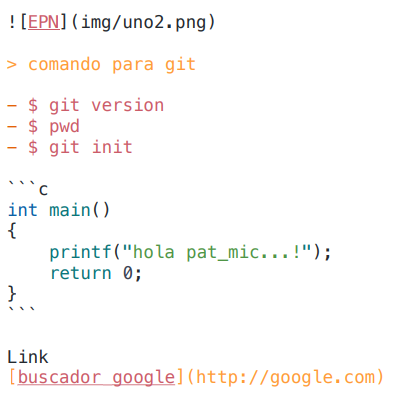

# <div align="center">**Escuela Politécnica Nacional**</div>
### <div align = "center">**Facultad de Ingeniería en Sistemas**</div>
### <div align = "center">**Ingeniería en Ciencias de la Computación**</div>
### <div align = "center">**Programación II**</div>
<br>
<br>
<p align = "center">
</p>
</br>
</br>

## **Semana 1**
### ***Clase 1: Martes, 30 de abril de 2024***
El primer encuentro entre estudiantes, presentación habitual y pautas de las clases mostradas a continuación:
##### *Datos generales*
- ***Dias de clase:*** Lunes/Martes/Miércoles
- ***Horario de clase:*** De 11h00 a 13h00
- <span style="background:#1FF000"> ***Puntualidad:*** Se permite llegar hasta 10 minutos tarde.</span>
- ***Profesor:*** Patricio Paccha (pat-mic)
##### *Indicaciones (Pruebas-Examenes-Proyecto)*
- Las pruebas durarán de 2 a 4 horas
- Los examenes durarán 8 horas
- El proyecto deberá tener una parte física, es decir, un aparato externo
- El proyecto deberá presentarse una parte al final del primer bimestre, y lo restante al final del semestre
- El markdown de cada estudiante deberá ser presentado al final de cada bimestre
##### *Recursos de trabajo grupal*
- Marcadores de pizarra
- Hojas de papel bond
- Pc's o celulares
- Pósits
- Taza de café (Opcional)
- Actidud: No trompud@, no brav@, no chuki
##### *Normativas*
- No llegar tarde a clases
- No hablar en el celular en clase, mantener en modo silencio
- Evitar comer alimentos en clase
- No distraerse en la computadora en actividades ajenas a la clase
- No entregar tareas, deberes, laboratorios, ni proyectos atrasados
- Subir las tareas a la plataforma virtual (o por correo)
- Pruebas teoricas en plataforma vitual (o escritas)
- Se tomará en cuenta la participación de eventos académicos que organice la Facultad de Sistemas
##### *Sistema de evaluaciones*
<center>

| Evaluación | Puntaje | Temporalidad |
|---|---|---|
| Prueba | 25% | Mensual |
|Examen|25%|Bimestral|
|Workshop|10%|Mensual|
|Homework|10%|Mensual|
|Proyecto|30%|Bimestral|

<br></br>
||||
|---|---|---|
|Actuacion|+0.1|Siempre|
|Retor|+1.0|Siempre|
</center>

##### *Taller MA01*
El taller consistió en realizar una torre de malvaviscos y fideos, los malvaviscos como uniones y los fideos como columnas/vigas, todo esto con la menor cantidad de recursos posibles e intentando obtener la mayor altura posible.

-------------------------------------------------------------------------
### ***Segunda Clase: Miércoles, 1 de mayo de 2024***

##### *Personalización* *del* *Visual* *Code* *y* *de* *Git* *bash*

* Para la personalización del Git Bash y del visual code, se puede personalizar su terminal para que esta sea la determinada en Visual Code y salga por defecto automaticamente, cada vez que se le llame con el comando CTRL + Ñ o manualmente.


Ademas se puede personalizar el git bash en si con la ayuda de otras aplicaciones externas, como por ejemplo: *Oh my posh* que es una de varias que pueden ayudar a darle un toque mas personal a la terminal y la consola de Git bash, con varios diseños y fuentes de se pueden instalar facilmente.


Esos son algunos de los diseños que se pueden conseguir en Oh *my posh*, de la misma forma la aplicacion permite crear un diseño nuevo, al final de la personalizacion se puede obtener un resultado asi en la terminal.


* De la misma forma se puede personalizar, el color de visual estudio con ayuda de los temas que vienen en la aplicación, pero tambien se pueden instalar otros, así mismo con los iconos de las aplicaciones o archivos que se abran dentro del visual.

* Tambien es recomendable cambiar la letra del visual code y de git bash para que sea mas comoda al momento de trabajar, pero eligiendo una que sea entendible y que facilite el trabajo.

Con todo eso listo, se puede tener una buena herramienta, que sea comoda y al gusto del usuario para trabajar adecuadamente.

##### *Comandos Linux*
1. pwd : lugar actual

2. touch readme.md : crear archivos  

3. code readme.md : abrir archivos     

4. ls : listar archivos y carpetas 

5. cd : cambia directorio de trabajo 

6. mkdir : crea nuevo directorio
   
7. rm : elimina un archivo 

8. cp : copiar archivos-directorios (incluido contenido)

9. mv : mueve o renombra archivos-directorios

10. file : comprueba tipo archivo

11. ls-la : lista ocultar archivos y directorios

12. nano, vi y jed : edita un archivo con un editor de texto

13. cat : lista, combina y escribe contenido de un archivo 

14. sed : busca, sustituye o elimina patrones en un archivo 

15. sort : reordena el contenido de un archivo 

16. diff : compara el contenido de dos archivos 

17. locate : busca archivos en la base de datos de un sistema

18. find : muestra ubicacion de un archivo o carpeta 

19. useradd/userdel : crea y elimina cuenta de usuario

20. df : muestra uso general de espacio en disco 

21. du : comprueba consumo almacenamiento de archivo o directorio

22. scp : copia de forma segura archivos o directorios a otro sistema

23. man : muestra el manual de un comando 

24. echo : imprime un mensaje como salida estandar 


##### *Comandos VSCode* 

1. Ctrl + Shif + P : abre paleta de comandos 

2. Ctrl + P : apertura rapida

3. Ctrl + B : abrir y cerrar el menu

4. Ctrl + D : cursor seleccion multiple

5. Shif + Alt + ⭡ / Shif + Alt + ⭣: copiar linea 

6. Shif + Alt + A (comentario varia lineas) | Ctrl + K + C (comentario una sola linea) : 
Bloque de codigo de comentario 

1. Alt + ⭠/⭢ : retroceder/avanzar 

2. Ctrl + T : mostrar todos los simbolos 

3. Ctrl + space | Ctrl + Shif + Space : sugerencia de activacion-parametros de activacion

4.  Ctrl + Shif + N : abre ventana nueva 
  
5.  Ctrl + Shif + W : cierra una ventana 

6.  Ctrl + C : copia fragmento de codigo 

7.  Ctrl + X : corta fragmento de codigo

8.  Ctrl + V : pega formato codigo copiado/cortado

9.  Ctrl + +/- : aumentar tamaño de letra/disminuir

10. Ctrl + O : abre explorador de archivos 

11. Ctrl + N : Crea un nuevo archivo 

12. Ctrl + S : Guarda 

13. Ctrl + F | Ctrl + H  : abre buscador | sustituir texto 

14. Ctrl + G : Desplazarnos a la linea que nos interesa

#### *Uso de Markdown* 

* **Tipo de letra:**
   - **palabras en negrita** : Con ** palabra-frase **
   - *palabras en cursiva* :  Con * palabra-frase * 
   - ***palabras en negrita y cursiva***: Con *** palabra-frase ***
   - ==texto resaltado== : Con == palabra-frase ==
   - ~~texto tachado~~: Con ~~ palabra-frase ~~

* **Listas:** 
  ###### Lista no ordenada: Añadiendo - por cada item                  
  - Elemento 1
  - Elemento 2
  - Elemento 3 
  ###### Lista ordenada: Añadiendo 1.y 2. sucesivamente por cada item
   1. Primer elemento 
   2. Segundo elemento 
   3. Tercer elemento
  
* **Enlaces:** 

 - [buscador google](http://google.com): Usando [nombre cualquiera] (link), sin espacio

 - : Usando 
* **Etiqueta:** 
 
 <br> Con 

 ##### *Codigo Java*

 ```java
public class Hola {

  // Clase principal de la aplicacion 

  public static void main(String[] args) {
    System.out.println();
  }
}
```
Iniciando con ´´´NombreLenguajeDeProgramación y terminando con ´´´
##### *Tabla* 

|Columna 1|Columna 2|
|--------|--------|
|    A    |    B    |
|    C    |    D    |

Usando 
|Nombre de columna 1|Nombre de columna n|
/|---|---|   Sin /
|fila 1 columna 1| fila 1 columna n|
|fila n columna 1| fila n columna n| 
##### *Bloques de codigo:* 
  - comillas invertidas ---> ´codigo en linea´
  - citas ---> crear citas utilizando el signo ">"

* Lineas horizontales: 
---------
  - Guiones: ------
  - Asteriscos: *****
  - Guiones bajos: _____
